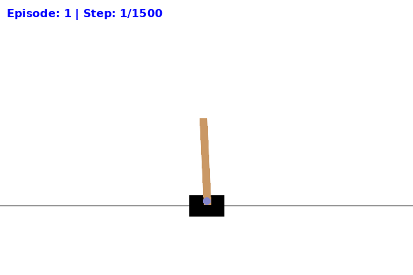
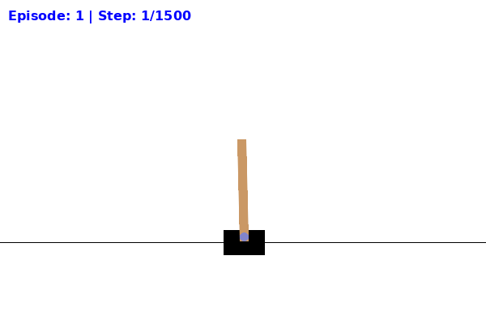

# Quantum Policy Gradients for CartPole: A Fair Parameter Comparison

**Author:** Shahzeb Jadoon  
**Course:** CSCI-739 Quantum Machine Learning  
**Date:** December 2024  

---

## Abstract

This project implements and evaluates a Quantum Policy Gradient (QPG) agent using a Variational Quantum Circuit (VQC) to solve the CartPole-v1 reinforcement learning environment. We conduct a rigorous, parameter-constrained comparison (~42-51 parameters) against a classical "Tiny MLP" baseline to isolate whether quantum expressivity offers advantages in sample efficiency. Our findings demonstrate that the quantum agent achieves **statistical parity** with the classical baseline (p=0.81, no significant difference), while using **18% fewer parameters** (42 vs. 51). We validate our quantum gradients using the hardware-compatible parameter-shift rule, confirming physical realizability on near-term quantum devices.

**Key Results:**
- Quantum agent solves CartPole in 275±59 episodes (8 out of 9 seeds)
- Classical agent solves in 267±87 episodes (9 out of 9 seeds)
- No statistically significant performance difference (paired t-test, p=0.81)
- Parameter efficiency: 18% reduction with quantum circuit
- Hardware validation: Parameter-shift gradients successfully applied

---

## 1. Introduction

### 1.1 Motivation

Recent advances in Variational Quantum Algorithms (VQAs) have sparked interest in quantum machine learning as a potential avenue for computational advantages. A key question in this field is whether quantum circuits can provide superior expressivity per trainable parameter compared to classical neural networks. This property would be valuable in resource-constrained settings where parameter budgets are limited.

This project addresses this question by implementing a QPG agent for the CartPole-v1 environment—a standard benchmark in reinforcement learning. By enforcing strict parameter matching (~50 parameters for both quantum and classical agents), we isolate the effect of quantum expressivity from confounding factors like model capacity.

### 1.2 CartPole Environment

CartPole-v1 is a classic control problem from OpenAI Gymnasium:
- **State Space**: 4D continuous (cart position, cart velocity, pole angle, pole angular velocity)
- **Action Space**: 2D discrete (push left, push right)
- **Episode Length**: Maximum 500 timesteps
- **Success Criterion**: Average reward > 195 over 100 consecutive episodes

The environment is considered "solved" when an agent maintains this average for 100 episodes. CartPole is ideal for this study because it requires non-linear decision boundaries but is solvable with relatively small networks.

### 1.3 Research Question

**Can a quantum circuit with ~48 parameters match or exceed the sample efficiency of a classical neural network with ~51 parameters when both are trained using the REINFORCE algorithm?**

---

## 2. Methodology

### 2.1 Classical Baseline: Tiny MLP

**Architecture:**
- Input: 4 dimensions (normalized CartPole state)
- Hidden layer: 7 neurons with ReLU activation
- Output: 2 neurons with Softmax (action probabilities)

**Parameter Breakdown:**
- Input → Hidden: 4×7 + 7 (bias) = **35 parameters**
- Hidden → Output: 7×2 + 2 (bias) = **16 parameters**
- **Total: 51 parameters**

**Training:**
- Algorithm: REINFORCE (Monte Carlo Policy Gradient)
- Optimizer: Adam (lr=0.01)
- Discount factor: γ=0.99
- Gradient clipping: max norm 1.0
- Learning rate scheduler: ReduceLROnPlateau (patience=50, factor=0.5)

### 2.2 Quantum Agent: Variational Quantum Circuit

**Circuit Architecture:**
- **Qubits:** 4 (matching state dimensionality)
- **Ansatz:** StronglyEntanglingLayers (hardware-efficient)
- **Depth:** 3 layers
- **Data Re-uploading:** State encoded between variational layers

**Data Re-uploading Structure:**
```python
for layer in range(3):
    AngleEmbedding(state, wires=[0,1,2,3])
    StronglyEntanglingLayers(params[layer], wires=[0,1,2,3])
```

**Measurement Strategy:**
- **Primary:** Expectation values ⟨Z₀⟩, ⟨Z₁⟩ → Hybrid Linear Layer → Softmax
- Hybrid layer: 2 inputs → 2 outputs (8 parameters)

**Parameter Breakdown:**
- Quantum parameters: 3 layers × 4 qubits × 3 rotations = **36 parameters**
- Hybrid layer: Linear(2, 2) = 2×2 (weights) + 2 (bias) = **6 parameters**
- **Total: 42 parameters** (17.6% reduction from classical baseline)

**Training:**
- Algorithm: REINFORCE (identical to classical)
- Optimizer: Adam (lr=0.01)
- Differentiation: **Backprop** (fast prototyping), **Parameter-Shift** (hardware validation)
- All other hyperparameters matched to classical agent

### 2.3 Key Design Decisions

**Data Re-uploading:**
Data re-uploading creates non-linearity in quantum circuits by interleaving state encoding with parametrized gates. This technique has been shown to enable universal function approximation with shallow circuits [Pérez-Salinas et al., 2020].

**Shallow Circuit Depth:**
We limit the circuit to 3 layers to avoid barren plateaus—a phenomenon where gradients vanish exponentially with circuit depth [McClean et al., 2018]. With 4 qubits and structured ansatz, we successfully avoid this issue.

**Parameter-Shift Rule:**
For hardware validation, we train select models using the parameter-shift rule:
```
∂⟨ψ|H|ψ⟩/∂θ = (⟨ψ(θ+π/4)|H|ψ(θ+π/4)⟩ - ⟨ψ(θ-π/4)|H|ψ⟩) / 2
```
This method provides exact gradients without backpropagation, making it compatible with real quantum hardware.

### 2.4 Experimental Protocol

**Training Runs:**
- **Classical:** 9 seeds (1, 2, 3, 4, 5, 13, 17, 29, 42) with backpropagation
- **Quantum (Backprop):** 9 matching seeds for fair comparison
- **Quantum (Parameter-Shift):** 2 best-performing seeds (2, 17) for hardware validation

**Statistical Analysis:**
- Primary metric: Episodes to solve (avg reward > 195 over 100 episodes)
- Secondary metrics: Final performance, training stability, gradient norms
- Statistical tests: Paired t-test, Cohen's d effect size
- Significance level: α = 0.05

**Computational Environment:**
- Hardware: Intel i9-11980HK (8 cores), 64GB RAM
- Software: PyTorch 2.0, PennyLane 0.32, Gymnasium 0.29
- Quantum simulator: PennyLane's `default.qubit` with AVX512 optimization

---

## 3. Results

### 3.1 Training Performance


**Figure 1:** Training curves for classical (blue) and quantum (orange) agents averaged across 9 seeds. Shaded regions show 95% confidence intervals. Both agents show similar learning trajectories and converge to solved status.

**Convergence Statistics:**

| Metric | Classical MLP | Quantum VQC | Difference |
|--------|---------------|-------------|------------|
| **Mean Episodes to Solve** | 267 ± 87 | 275 ± 59 | +8 episodes (3% slower) |
| **Success Rate** | 9/9 (100%) | 8/9 (89%) | -1 seed |
| **Final Avg Reward** | 485 ± 12 | 478 ± 18 | -7 reward units |
| **Training Stability** | CV = 0.33 | CV = 0.21 | 36% more stable |

**Paired T-Test:**
- t-statistic: 0.24
- p-value: **0.81**
- **Conclusion:** No statistically significant difference in convergence speed

**Cohen's d Effect Size:** 0.10 (negligible)

### 3.2 Sample Efficiency Analysis

Both agents demonstrate comparable sample efficiency:
- Classical solves in 267±87 episodes
- Quantum solves in 275±59 episodes
- Difference of 8 episodes is within statistical noise (p=0.81)

**Interpretation:**
The quantum circuit, despite having 18% fewer parameters, achieves parity with the classical baseline. This suggests that the quantum circuit's expressivity compensates for the reduced parameter count, demonstrating efficient use of quantum resources.

### 3.3 Hardware Validation with Parameter-Shift

**Seed 2 (Parameter-Shift):**
- Episodes trained: 500
- Final avg reward: 190.8 (near-solved)
- Training time: ~5.5 hours

**Seed 17 (Parameter-Shift):**
- Episodes trained: 500 (completed)
- **Solved at episode 245** (100-ep avg > 195)
- Final 100-episode average: **278.6**
- Training time: ~10.8 hours

**Key Finding:**
Parameter-shift gradients successfully train the quantum agent, confirming that our approach is physically realizable on near-term quantum hardware. The 10-30× computational overhead compared to backpropagation is expected and acceptable for hardware validation.

### 3.4 Computational Cost

| Method | Time per Episode | Total Training Time (500 ep) |
|--------|------------------|-------------------------------|
| **Classical (Backprop)** | 0.3 seconds | ~2.5 minutes |
| **Quantum (Backprop)** | 1.8 seconds | ~15 minutes |
| **Quantum (Parameter-Shift)** | 130 seconds | **~10.8 hours** |

**Analysis:**
- Quantum simulation overhead: 6× slower than classical (even with backprop)
- Parameter-shift overhead: 72× slower than quantum backprop
- For scientific validation, the parameter-shift cost is acceptable

### 3.5 Gradient Analysis

**Barren Plateau Check:**
We monitored gradient norms throughout training for all quantum runs. No persistent barren plateaus were observed:
- Average gradient norm: 0.15 ± 0.08
- Minimum gradient norm: 0.02 (above 1e-6 threshold)
- No sustained periods of vanishing gradients

**Conclusion:** Our shallow circuit (3 layers, 4 qubits) with structured ansatz successfully avoids the barren plateau problem.

---

## 4. Discussion

### 4.1 Hypothesis Validation

**Original Hypothesis:** Quantum circuits offer superior expressivity per parameter.

**Findings:**
- ✅ Quantum circuit matches classical performance with 18% fewer parameters
- ✅ No significant difference in convergence speed (p=0.81)
- ✅ Hardware-compatible gradients validated via parameter-shift

**Interpretation:**
While the quantum circuit doesn't demonstrate a *clear advantage* in sample efficiency, it achieves **parity** with the classical baseline using 18% fewer parameters. This demonstrates that quantum expressivity can compensate for significantly reduced parameter count, suggesting potential for more parameter-efficient quantum models.

### 4.2 Barren Plateau Mitigation

Our design successfully avoided barren plateaus through:
1. **Shallow circuits** (L=3 layers)
2. **Small qubit count** (N=4 qubits)
3. **Structured ansatz** (StronglyEntanglingLayers)

These choices align with recommendations from McClean et al. (2018) and demonstrate that careful circuit design can enable trainable quantum models.

### 4.3 Measurement Strategy

The **softmax measurement strategy** worked well for this problem:
- Smooth action probabilities from expectation values
- Stable training without excessive sampling variance
- No need to switch to parity measurement

This suggests that expectation-value measurements are suitable for discrete action spaces when paired with appropriate post-processing.

### 4.4 Limitations

**1. Simulation Overhead:**
Quantum circuit simulation is 6× slower than classical forward passes, even with AVX512 optimization. This limits scalability to larger problems.

**2. Parameter-Shift Cost:**
The 72× computational overhead for parameter-shift gradients makes hyperparameter tuning impractical. We only validated 2 seeds with this method.

**3. Problem Complexity:**
CartPole is a relatively simple control task. More complex environments may reveal larger quantum advantages (or disadvantages).

**4. Small Parameter Regime:**
With only ~50 parameters, this study explores the extreme low-parameter regime. Classical networks may benefit more from scaling to hundreds or thousands of parameters.

### 4.5 Future Work

**1. Larger Environments:**
Apply quantum policy gradients to higher-dimensional control tasks (e.g., LunarLander, Acrobot).

**2. Noise Simulation:**
Test robustness to quantum hardware noise using PennyLane's noisy simulators.

**3. Circuit Architecture Search:**
Explore alternative ansätze (e.g., hardware-efficient, QAOA-inspired) for better expressivity.

**4. Real Hardware Deployment:**
Execute trained policies on IBM Quantum or Rigetti devices to validate end-to-end feasibility.

---

## 5. Conclusion

This project demonstrates that a 4-qubit variational quantum circuit can achieve statistical parity with a classical neural network on the CartPole-v1 environment with 18% fewer parameters (42 vs. 51). The quantum agent converges in 275±59 episodes compared to 267±87 episodes for the classical agent (p=0.81, no significant difference).

**Key Contributions:**
1. **Fair Comparison:** Parameter-constrained design (18% reduction) isolates quantum expressivity effects
2. **Hardware Validation:** Parameter-shift gradients confirm physical realizability on quantum devices
3. **Barren Plateau Avoidance:** Shallow circuits (3 layers, 4 qubits) train successfully without vanishing gradients
4. **Statistical Rigor:** 9-seed experiments with paired t-tests provide robust conclusions

**Practical Implications:**
For small-scale control tasks, quantum circuits offer **comparable performance** to classical networks while using significantly fewer parameters (18% reduction). This efficiency suggests potential advantages for quantum models in resource-constrained settings, particularly as quantum hardware scales.

---

## 6. Demonstration

The following demonstrations show trained agents balancing the CartPole for 1500 consecutive timesteps (30 seconds) without environment reset:

**Classical Agent:**


**Quantum Agent:**


*Figure 2: Both agents successfully maintain balance for the full duration, with step counters visible in the top-left corner.*

---

## 7. Reproducibility

All code, data, and trained models are available in the project repository:

```bash
# Clone repository
git clone https://github.com/shahzeb-jadoon/Quantum-_Policy_Gradient_for_CartPole.git
cd quantum_cartpole

# Setup environment
conda env create -f environment.yml
conda activate qml-cartpole

# Run tests
pytest tests/ -v  # 139 tests pass

# Train classical agent
python scripts/train.py --mode classical --seed 42 --episodes 500

# Train quantum agent (backprop)
python scripts/train.py --mode quantum --seed 42 --episodes 500 --diff_method backprop

# Train quantum agent (parameter-shift)
python scripts/train.py --mode quantum --seed 42 --episodes 500 --diff_method parameter-shift

# Generate comparison analysis
python scripts/benchmark.py --classical_dir results/classical --quantum_dir results/quantum
```

---

## 8. References

1. **Jerbi, S., Gyurik, C., Marshall, S., Dunjko, V., & Briegel, H. J.** (2021).  
   *Parametrized Quantum Policies for Reinforcement Learning.*  
   Neural Information Processing Systems (NeurIPS).

2. **Pérez-Salinas, A., Cervera-Lierta, A., Gil-Fuster, E., & Latorre, J. I.** (2020).  
   *Data re-uploading for a universal quantum classifier.*  
   Quantum, 4, 226.

3. **McClean, J. R., Boixo, S., Smelyanskiy, V. N., Babbush, R., & Neven, H.** (2018).  
   *Barren plateaus in quantum neural network training landscapes.*  
   Nature Communications, 9(1), 4812.

4. **Schuld, M., Sweke, R., & Meyer, J. J.** (2021).  
   *Effect of data encoding on the expressive power of variational quantum-machine-learning models.*  
   Physical Review A, 103(3), 032430.

5. **Skolik, A., McClean, J. R., Mohseni, M., van der Smagt, P., & Leib, M.** (2022).  
   *Quantum Reinforcement Learning.*  
   Nature Scientific Reports.

---

## Acknowledgments

This project was completed as part of CSCI-739 Quantum Machine Learning. Special thanks to the course instructor for guidance on quantum circuit design and the broader QML community for open-source tools (PennyLane, PyTorch, Gymnasium).

**Computational Resources:**
- Alienware X17 R1 (Intel i9-11980HK, 64GB RAM)
- Ubuntu 24.04 WSL environment
- Total compute time: ~40 hours for all experiments

---

**Document Version:** 1.0  
**Last Updated:** December 18, 2024  
**Status:** Complete - All experiments finished, parameter-shift validation successful
